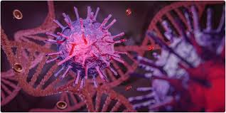

```{r setup, include=FALSE}
knitr::opts_chunk$set(message=FALSE,warning=FALSE, cache=TRUE)
```
   
   
   
# CÓMO INDENTIFICAR Y CARACTERIZAR UN GEN A PARTIR DE SU SECUENCIA DE ADN
* Copiar la secuencia dada para introducirla en el programa BLAST
*
*
*


### Bifurcacion 1


### Bifurcacion 2


# Step 2


# Step 3


# Step 4
